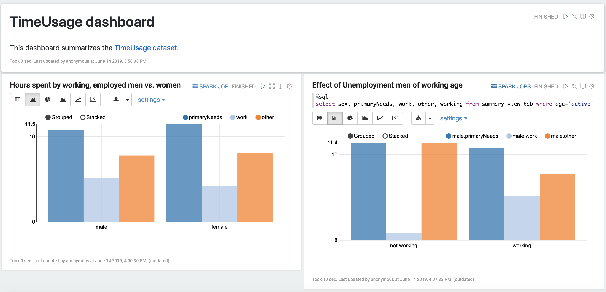

# scala-spark-ln repo

## Introduction
Spark and Scala learning submissions for EPFL courses.

## TimeUsage analysis

The [dataset](http://alaska.epfl.ch/~dockermoocs/bigdata/atussum.csv) used is the Activity Summary file 
of the [American Time Use Survey](https://www.kaggle.com/bls/american-time-use-survey) on Kaggle.

### Dashboard

The TimeUsage Zeppelin Dashboard is checked in [here](TimeUsage.json). It can be imported and viewed in your own Zepellin instance.

The Dashboard does a comparison of time spending characteristics between -

1. Employed Men vs. Women of working age
2. Employed Men vs. Unemployed Men of working age

.


### Build & Assemble Instructions

`git clone https://github.com/kevvo83/scala-spark-ln.git`

`sbt clean update week3/compile week3/assembly`

(Note: You may need to download the [SBT utility](https://www.scala-sbt.org/download.html))

### Spark Job Submit Instructions

The Assembly Jar should be downloaded to local location (I've used `/home/ec2-user/` on EMR).

The Access Key and Secret Key are the IAM Credentials of an IAM User that can access the S3 Bucket where the datafile is stored.

To submit directly on the Master server, SSH to the Master server and run this command (tested on AWS EMR) -
```
sudo spark-submit --class timeusage.TimeUsage \
--deploy-mode cluster --master yarn \
--num-executors 2 --conf spark.executor.cores=2 \
--conf spark.executor.memory=2g --conf spark.driver.memory=1g \
--conf spark.driver.cores=1 --conf spark.logConf=true \
--conf spark.yarn.appMasterEnv.SPARKMASTER=yarn \
--conf spark.yarn.appMasterEnv.WAREHOUSEDIR=s3a://***S3OUTPUTBUCKET***/spark-warehouse \
--conf spark.yarn.appMasterEnv.S3AACCESSKEY=***S3ACCESSKEY*** \
--conf spark.yarn.appMasterEnv.S3ASECRETKEY=***S3SECRETKEY*** \
--conf yarn.log-aggregation-enable=true \
--conf spark.yarn.jars=/usr/lib/spark/jars/*.jar \
--conf spark.yarn.preserve.staging.files=true \
--conf spark.executorEnv.SPARK_HOME=/usr/lib/spark/ \
--conf yarn.nodemanager.delete.debug-delay-sec=36000 \
--conf spark.network.timeout=600000 \
--files /usr/lib/spark/conf/spark-defaults.conf \
--jars /home/ec2-user/week3-assembly-0.1.0-SNAPSHOT.jar \
/home/ec2-user/week3-assembly-0.1.0-SNAPSHOT.jar \
s3a://***S3BUCKET***/atussum.csv
```

## Present in this Repository

RDDs, DataSets, DataFrames.

KMeans Clustering.

Unit Tests using FunSuite.

Compare efficienty of Operations such as groupByKey vs. reduceByKey.

DataSets Typed Operations.

DataFrames Untyped Operations.
